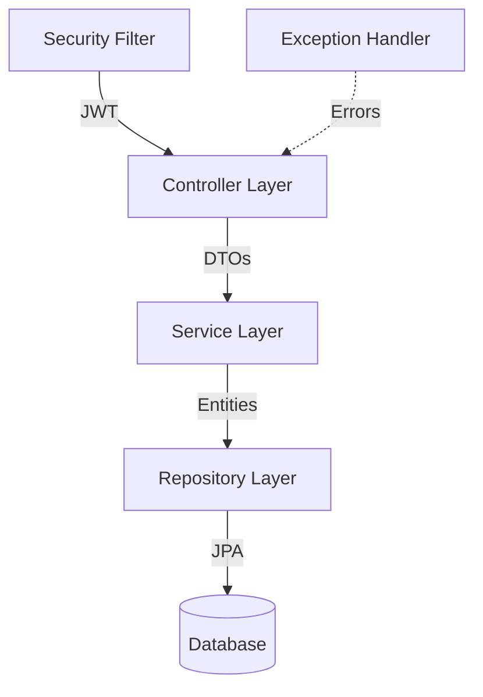

# Eco Cusco API

<div align="center">


**API RESTful para la gestión de reportes ciudadanos sobre limpieza pública y mantenimiento urbano en Cusco**

[Características](#-características) •
[Instalación](#-instalación-rápida) •
[Documentación](#-documentación) •
[API](#-api-endpoints) •
[Contribuir](#-contribuir)

</div>

---

## Descripción

**Eco Cusco** es una API backend moderna construida con Spring Boot que permite a los ciudadanos reportar problemas de limpieza y mantenimiento urbano en la ciudad de Cusco. La plataforma facilita la gestión, seguimiento y resolución de reportes georeferenciados mediante una arquitectura limpia, segura y escalable.

### Objetivo

Crear un puente de comunicación eficiente entre ciudadanos y autoridades municipales para mejorar la limpieza y el mantenimiento urbano en Cusco.

---

## Características

### Core Features
- **Autenticación JWT**: Sistema seguro de autenticación basado en tokens
- **Gestión de Usuarios**: Registro, login y administración de usuarios con roles
- **Reportes Georeferenciados**: Creación y gestión de reportes con ubicación exacta
- **Estados Configurables**: Flujo de trabajo definido (PENDIENTE → EN_PROCESO → RESUELTO)
- **Filtros Avanzados**: Búsqueda por usuario, estado, distrito y más
- **Soporte Multi-media**: URLs de fotos asociadas a reportes
- **Historial de Estados**: Tracking completo de cambios de estado con notas

### Technical Features
- **Arquitectura en Capas**: Separación clara de responsabilidades
- **Seguridad Spring Security**: Protección de endpoints y autorización
- **Validaciones Robustas**: Bean Validation con mensajes personalizados
- **CORS Configurado**: Listo para integración con frontends
- **OpenAPI/Swagger**: Documentación automática e interactiva
- **Multi-database**: H2 para desarrollo, PostgreSQL para producción
- **Perfiles de Configuración**: Ambientes separados (dev/prod)

---

## Arquitectura

### Estructura del Proyecto

```
src/main/java/com/cusco/limpio/
├── config/                 # Configuraciones (Security, CORS, OpenAPI)
├── controller/             # Endpoints REST
├── domain/                 # Modelos de dominio y enums
│   ├── enums/             # Estados de reportes
│   ├── events/            # Eventos del dominio
│   └── model/             # Entidades JPA
├── dto/                   # Data Transfer Objects
│   ├── report/            # DTOs de reportes
│   └── user/              # DTOs de usuarios
├── exception/             # Excepciones personalizadas y manejador global
├── mapper/                # Mappers Entity ↔ DTO
├── repository/            # Repositorios JPA
├── security/              # JWT, filtros, UserDetails
├── service/               # Interfaces de servicio
│   └── impl/              # Implementaciones de servicios
└── util/                  # Utilidades (fechas, geo, responses)

src/test/java/com/cusco/limpio/
├── controller/            # Tests de controladores
├── service/               # Tests de servicios
│   └── impl/              # Tests de implementaciones
└── CuscoLimpioApiApplicationTests.java
```

### Capas de la Aplicación



---

## Tecnologías

| Tecnología | Versión | Propósito |
|-----------|---------|-----------|
| **Java** | 17+ | Lenguaje de programación |
| **Spring Boot** | 3.3.6 | Framework principal |
| **Spring Security** | 3.3.6 | Autenticación y autorización |
| **Spring Data JPA** | 3.3.6 | Persistencia de datos |
| **JWT (jjwt)** | 0.12.5 | Tokens de autenticación |
| **Lombok** | Latest | Reducción de boilerplate |
| **PostgreSQL** | Latest | Base de datos producción |
| **H2** | Latest | Base de datos desarrollo |
| **SpringDoc OpenAPI** | 2.1.0 | Documentación API |
| **Maven** | 3.6+ | Gestión de dependencias |

---

## Instalación Rápida

### Prerequisitos

- **Java 17+** - [Descargar](https://adoptium.net/)
- **Maven 3.6+** - [Descargar](https://maven.apache.org/download.cgi)
- **PostgreSQL** (solo para producción) - [Descargar](https://www.postgresql.org/download/)

### Pasos de Instalación

1. **Clonar el repositorio**
   ```bash
   git clone https://github.com/EzerZuniga/eco-cusco.git
   cd eco-cusco
   ```

2. **Compilar el proyecto**
   ```bash
   # Con Maven
   mvn clean install
   
   # Con el script incluido (Windows)
   build.bat
   
   # Para compilar sin ejecutar tests
   build.bat skip-tests
   ```

3. **Ejecutar en modo desarrollo**
   ```bash
   # Con Maven
   mvn spring-boot:run -Dspring-boot.run.profiles=dev
   
   # Con el script incluido (Windows)
   run.bat
   
   # Para usar otro perfil
   run.bat prod
   ```

4. **Ejecutar tests**
   ```bash
   # Con Maven
   mvn test
   
   # Con el script incluido (Windows)
   test.bat
   ```

5. **Acceder a la aplicación**
   - API: http://localhost:8080
   - Swagger UI: http://localhost:8080/swagger-ui.html
   - H2 Console: http://localhost:8080/h2-console

---
---

## Seguridad

### Autenticación JWT

1. Login con credenciales válidas
2. Recibir token JWT en la respuesta
3. Incluir token en header: `Authorization: Bearer {token}`
4. Token válido por 24 horas (configurable)
